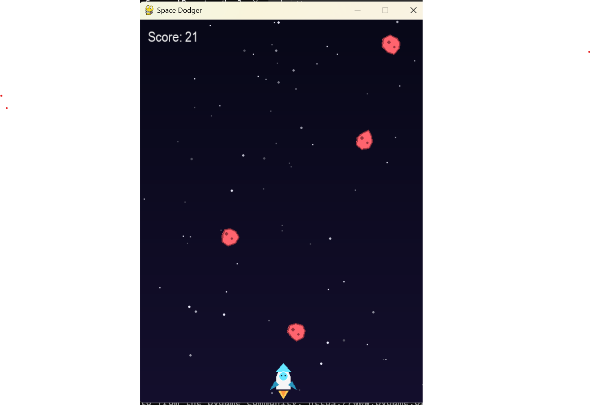

# Space Dodger 🚀

A simple arcade game built with Python and Pygame. Dodge falling asteroids and survive as long as you can — the game gets harder the longer you last!

## How to Play
- Press `SPACE` to start
- Use arrow keys to move your ship
- Avoid the red asteroids
- Press `R` to restart after game over

## Setup

```bash
python3 -m venv venv
venv\Scripts\activate      # Windows
source venv/bin/activate   # macOS/Linux
pip install -r requirements.txt
python3 main.py
```
